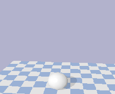

# Shapes3D

Shapes3D is a simple 3D environment made up 3D figures. It is an environment for computer vision problems which can spawn different 3D shapes (e.g. spheres or boxes) in a simple 3D world and render the view from any point of view using a pinhole camera model (i.e. intrinsic and extrinsic matrices). This environment resembles the environment from [Neural scene representation and rendering](https://deepmind.com/blog/article/neural-scene-representation-and-rendering) or GQN.

## Instructions

There are two ways of installing this environment, using docker or installing this locally.

### A. Installing locally

In the root folder run `pip install -e .`

### B. Docker

The use of a docker container is highly recommended if EGL has compatibility issues and you must use EGL. *warning*: the render from EGL is not exactly the same as the rest of the renderers, test EGL first to see if it works for you. Follow the next steps to have a docker container capable of running this environment. Build the docker container with

    docker build . -f docker/shapes3d.dockerfile -n shapes3d

There are two ways of working with the docker container
1. Launch the docker container with GPU access with `docker run --rm -ti --gpus all shapes3d bash` or running `sh launch_env.sh` (which supports display rendering). **Keep in mind** that the container will be removed (and with it all its new files) after leaving the container. Use something `volumes` to have a linked folder outside the container. This way of launching the container will use the last commit of master to build the repo. So do not forget to `git pull` if you need to add new changes to the repo.
2. Launch the docker container with this repo root folder as volume. All changes made in this folder will be reflected in the docker container, the environment shape3d is the current folder with **all** its latest changes. Run `sh launch_dev_env.sh`.

For example to run a specific command in the docker container use `sh launch_env.sh python examples/simple_example.py` or if you want just to connect to the container terminal use `sh launch_env.sh bash`.

Keep in mind that whenever you want to use the GUI of the simulation you have to allow the xhost connection. In that case run `xhost +` (this is not recommended for production environments)

## Examples

After installing the environment you can run the examples inside `examples` folder. for example `python examples/simple_example.py` or `python examples/saver_render.py`

## Functions

To see an example of how to use the environment see `examples/simple_example.py`.

| Function                                                    | Inputs                                                       | Description                                                  |
| ----------------------------------------------------------- | ------------------------------------------------------------ | ------------------------------------------------------------ |
| Shapes3D                                                    | **gui** (bool): Is or not the gui **use_egl_plugin** (bool): Is or not the EGL plugin to speed up **rendering**. Renders with and without using the plugin are no the same due to EGL bugs **env_dim** (int): The dimensions of the environment | Constructor.  **Returns** env (Shapes3D object)         |
| reset                                                       | -                                                            | Resets the environment (i.e. removes all objects)             |
| add_sphere add_cube add_capsule add_cylinder | **color** ([int, int, int, int]): RGB alpha in [0..1] **position** ([int, int, int]): The position in the space, max: env_dim/2 **orientation** ([int, int, int]): The orientation in space, yaw, pitch, roll in degrees **radius** (int): radius (only for sphere, capsule and cylinder) **dimensions** ([int, int, int]): Dimensions of the cube (x,y,z) (only for cube) **length** (int): Length of the object (only for capsule and cylinder) | Adds the corresponding object.  **Returns** its body_id  |
| remove_object                                               | **object_id**: as returned by add_sphere/cube/capsule/cylinder | Removes an object from the world                              |
| render                                                      | **width** (int) : of output image in pixels **height** (int) : of output image in pixels **position** ([int, int, int]): The position of the camera in the space **distance**: Distance from position **yaw**, **pitch**, **roll** (int): orientation **fov** (float): Field of View in degrees [0..360] aspect (float): aspect ratio | Renders the environment with the camera specified with the parameters.  **Returns** image_array, depth_map, segmentation_map |
| compute_render                                              | **width** (int) : of output image in pixels **height** (int) : of output image in pixels **intrinsic** (numpy array): Intrinsic matrix of the pinhole camera model **extrinsic** (numpy array): Extrinsic matrix of the pinhole camera model | Renders the environment with the camera defined by the intrinsic and extrinsic matrices.  **Returns** image_array, depth_map, segmentation_map |
| destroy                                                     | -                                                            | Destroys the environment properly                            |

## Known issues

* There are certain versions of OpenGL or GLSL which are not compatible with the EGL renderer (to render faster):
    * Simplest: do not use the ELG plugin, set `use_egl_plugin=False` when creating the env.
    * Best: If you do want to use the EGL renderer you can use the docker container. See docker section
    * Workaround: set the variable `MESA_GL_VERSION_OVERRIDE` to some version, e.g. `export MESA_GL_VERSION_OVERRIDE=19.1`.
